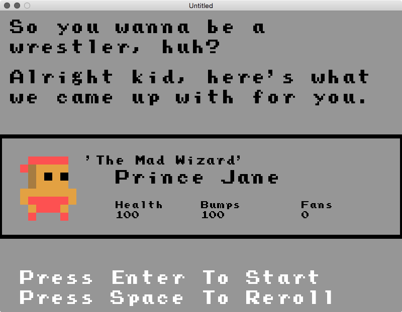
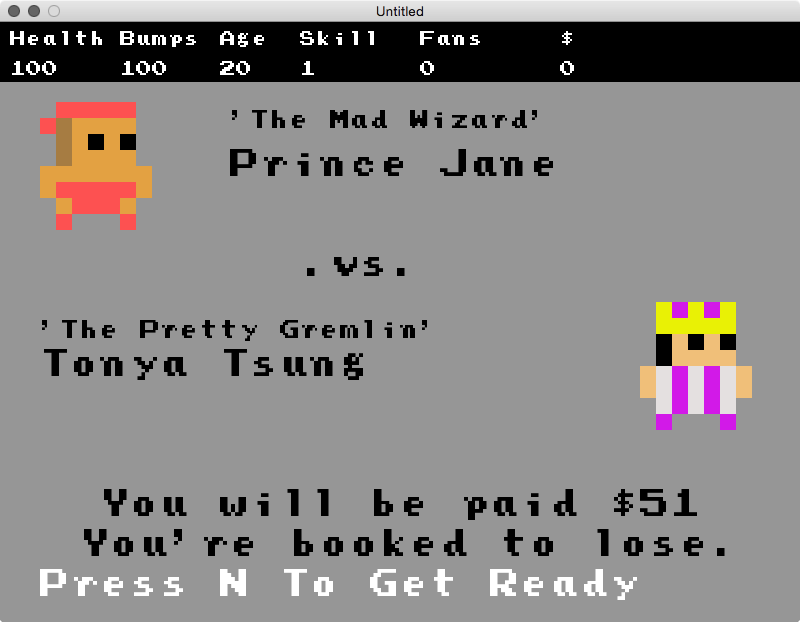

#WHAT

Rassler is a pro wrestling simulation game set during the golden age of territories. It is written in Lua with [Love2d](https://love2d.org). [@philnelson](http://twitter.com/philnelson) is building it for fun.

# SCREENS

The game kinda looks like this

# MUSIC

Music is from [http://ericskiff.com/music/](http://ericskiff.com/music/)